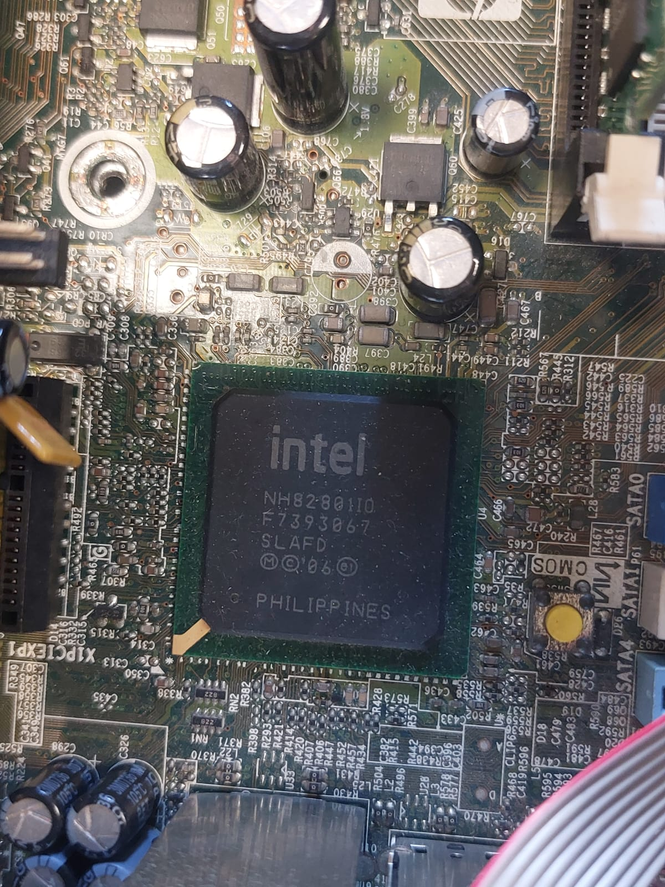
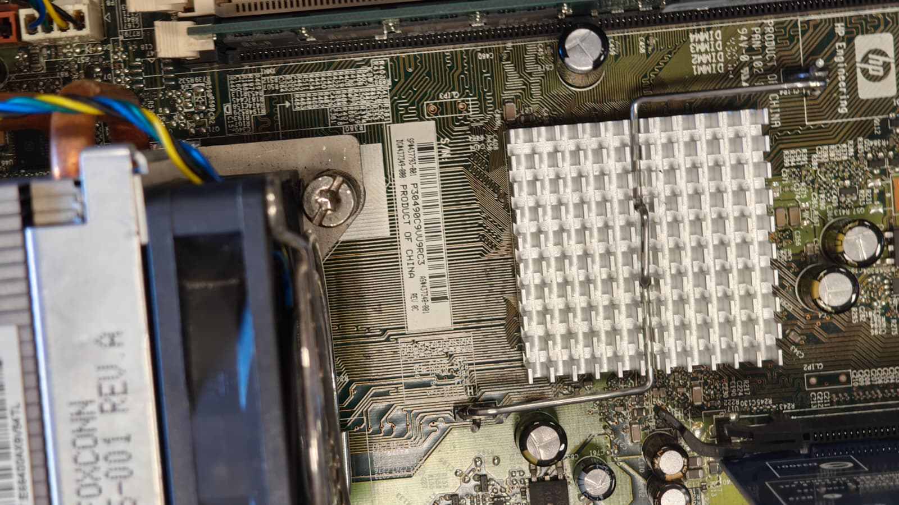
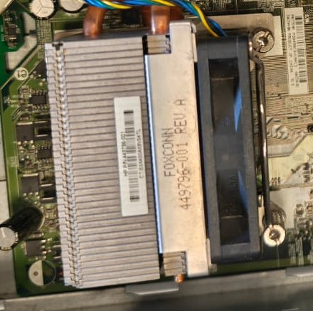
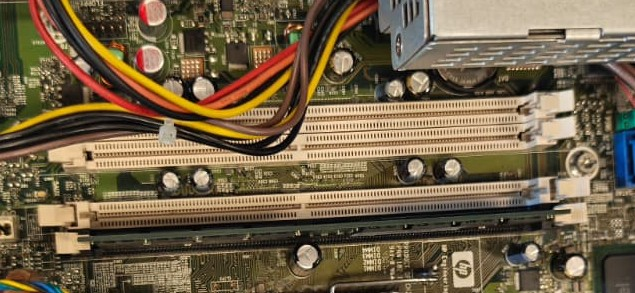
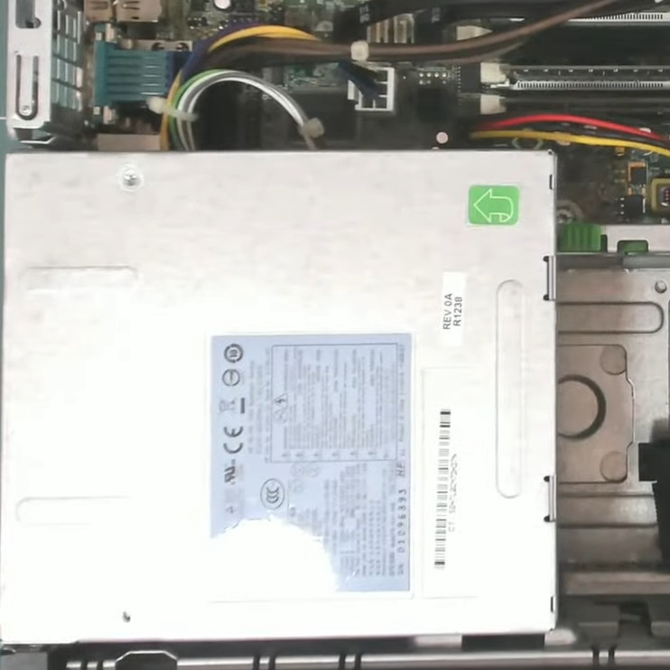
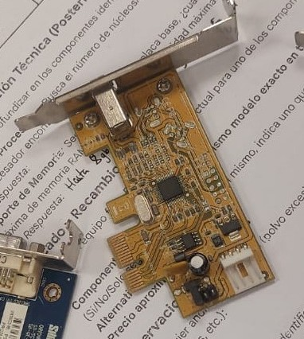
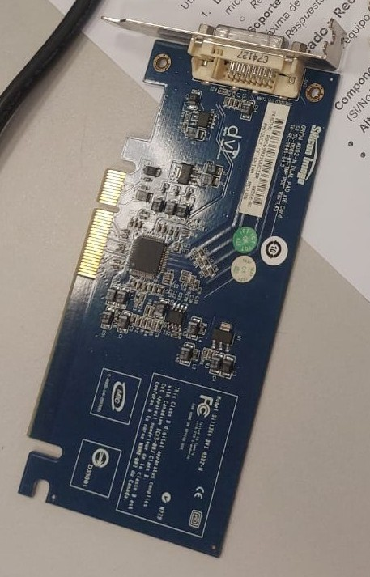
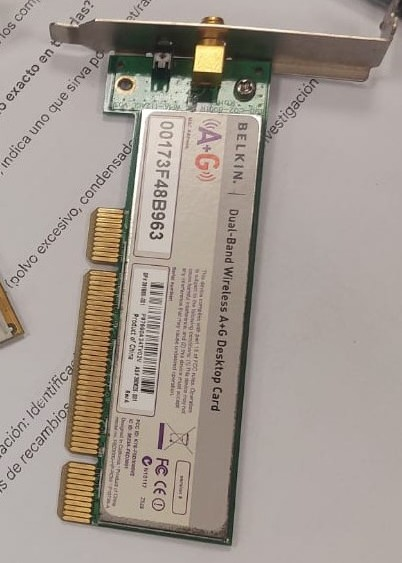

# 10 — Toma de datos (taller)

| Componente                 | Marca/Fabricante | Modelo/Serie             | Características técnicas visibles                                          | Foto                                                                                                                                                                                           |
| -------------------------- | ---------------- | ------------------------ | -------------------------------------------------------------------------- | ---------------------------------------------------------------------------------------------------------------------------------------------------------------------------------------------- |
| **Placa base**             | HP Compaq        | DC7800P                  | **Chipset:** Intel Q35 Express / **Socket:**  LGA775 / **Nº slots RAM:** 4 |     |
| **Microprocesador**        | Intel            | Core 2 Duo CPU E6750     | **Frecuencia:** @2.66GHz                                                   |                                                                                                                                        |
| **Memoria RAM**            | Elpida           | PC2-5300U                | **Tipo:** DDR2, **Capacidad:** 1GB, **Frecuencia:** 667MHz                 |                                                                                                                                        |
| **Disco HDD/SSD**          | No tiene         | -                        | **Interfaz (SATA/M.2):** solo SSD SATA o HDD, **Capacidad:** -             | -                                                                                                                                                                                              |
| **Fuente de alimentación** | HP               | DPS-240MB-1A             | **Potencia (W):** 240 W, **Certificación (80+):** No                       |                                                                                                                                        |
| **Otros (GPU/Tarjetas)**   | Texas Instrument | Controladora             | Firewire                                                                   |                                                                                                                                |
| **Otros (GPU/Tarjetas)**   | Silicon Image    | Sil1364 DVI ADD2-N N 279 | Tarjeta adaptadora DVI (ADD2)                                              |                                                                                                                                |
| **Otros (GPU/Tarjetas)**   | Belkin           | Tarjeta de red           | Wireless                                                                   |                                                                                                                                |
