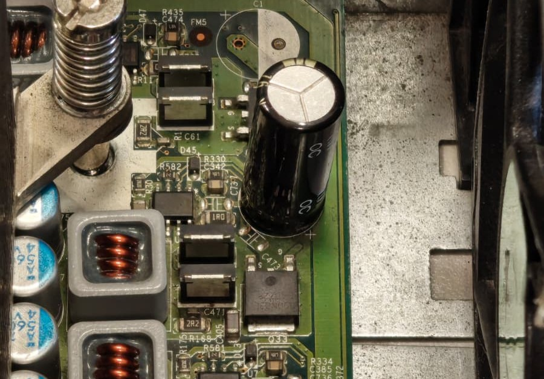
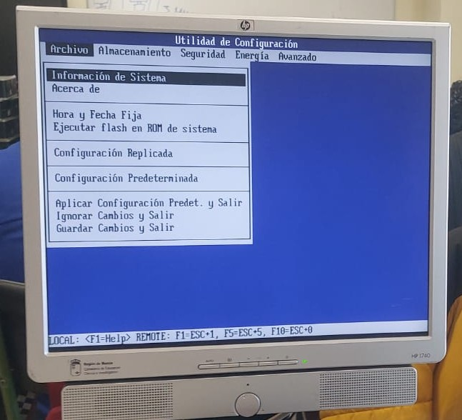
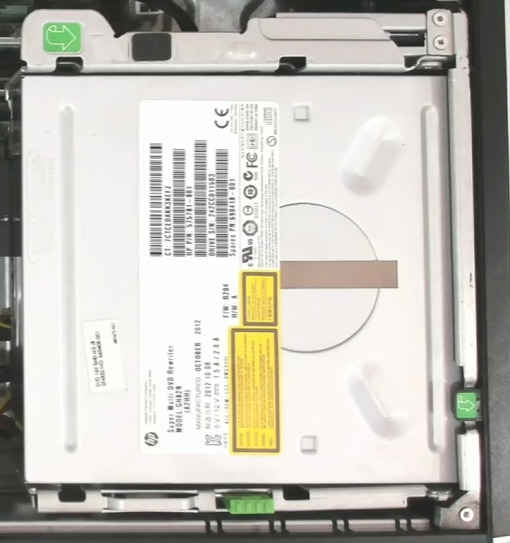
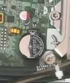

# 40 — Observaciones personales

- **Observación 1:** Algunos condensadores se encuentran bastante sueltos, aunque no están hinchados ni quemados. 
	

- **Observación 2:** No hay unidades de almacenamiento, ya sean HDD o SSD, por tanto, al encender el ordenador nos llevará a la BIOS. 
	

- **Observación 3:** Solo se usa el único Gigabyte de RAM que tiene en solo canal, en vez de usar Dual Channel. 
	

- **Observación 3:** La disquetera y el lector de CDs estaban desconectadas de la placa base y de la fuente, y al conectarlas a la fuente de alimentación, deja de encender, teniendo un posible cortocircuito. 
	

- **Observación 4:** La pila de CMOS estaba gastada. 
	
