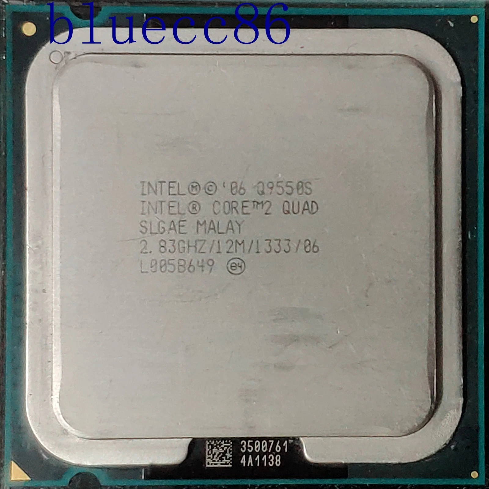
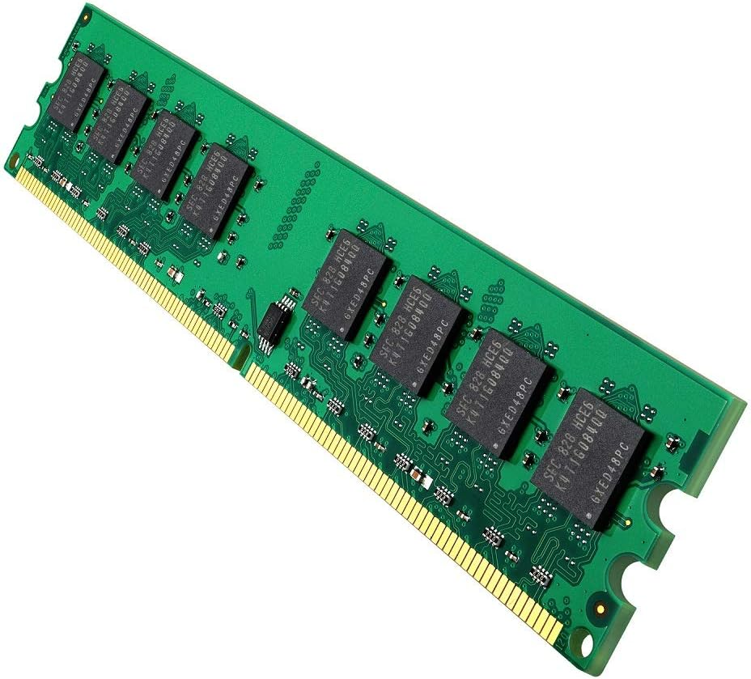
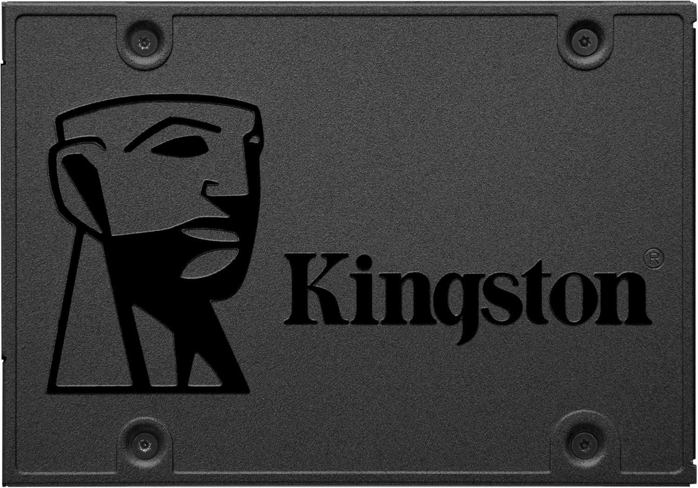

# 90 — ENTREGA ÚNICA (consolidado)

## Portada
- Alumno/a: _Andrés Tahoe López Muñoz_
- Puesto/Equipo asignado: _Grupo 2_
- Fecha: _24/01/2026_
- Módulo: **Fundamentos de Hardware (1º ASIR)**
- Unidad: **UT3 — Ensamblado de equipos**
- Reto: **Reto 01 — Práctica de Taller**

## Índice
1. [Portada](00-portada.md)
2. [Instrucciones](02-instrucciones.md)
3. [Toma de datos en taller](tabla_taller.md)
4. [Investigación técnica](investigacion.md)
5. [Mercado y recambios](30-mercado_y_recambios/recambios.md)
6. [Observaciones personales](observaciones.md)
7. [ENTREGA ÚNICA](90-ENTREGA_UNICA.md)
8. [Checklist](99-entrega_y_checklist.md)

---
## Toma de datos — resumen
# 10 — Toma de datos (taller)

| Componente                 | Marca/Fabricante | Modelo/Serie             | Características técnicas visibles                                          | Foto                                                                                                                                                                                  |
| -------------------------- | ---------------- | ------------------------ | -------------------------------------------------------------------------- | ------------------------------------------------------------------------------------------------------------------------------------------------------------------------------------- |
| **Placa base**             | HP Compaq        | DC7800P                  | **Chipset:** Intel Q35 Express / **Socket:**  LGA775 / **Nº slots RAM:** 4 |     |
| **Microprocesador**        | Intel            | Core 2 Duo CPU E6750     | **Frecuencia:** @2.66GHz                                                   |                                                                                                                                  |
| **Memoria RAM**            | Elpida           | PC2-5300U                | **Tipo:** DDR2, **Capacidad:** 1GB, **Frecuencia:** 667MHz                 |                                                                                                                                  |
| **Disco HDD/SSD**          | No tiene         | -                        | **Interfaz (SATA/M.2):** solo SSD SATA o HDD, **Capacidad:** -             | -                                                                                                                                                                                     |
| **Fuente de alimentación** | HP               | DPS-240MB-1A             | **Potencia (W):** 240 W, **Certificación (80+):** No                       |                                                                                                                                  |
| **Otros (GPU/Tarjetas)**   | Texas Instrument | Controladora             | Firewire                                                                   |                                                                                                                          |
| **Otros (GPU/Tarjetas)**   | Silicon Image    | Sil1364 DVI ADD2-N N 279 | Tarjeta adaptadora DVI (ADD2)                                              |                                                                                                                          |
| **Otros (GPU/Tarjetas)**   | Belkin           | Tarjeta de red           | Wireless                                                                   |                                                                                                                          |

---
## Investigación técnica — resumen
# 20 — Investigación técnica (posterior)

## 1) Detalles del procesador
- **Modelo exacto:** Intel Core 2 Duo CPU E6750
- **Núcleos/Hilos:**  2 Núcleos, 2 Hilos
- **TDP:**  65W

## 2) Soporte de memoria (según placa base)
- **Modelo exacto de placa:** HP Compaq DC7800P Motherboard
- **Capacidad máxima RAM:**  Hasta 8Gb de DDR2, entre 512MB y 2GB por slots, dependiendo de la distribución en los canales.
- **Velocidad máxima soportada:** hasta 1000 MT/s a 800 MHz / 667 MHz

---
## Recambios — resumen
# 30 — Mercado y recambios

**Componente a sustituir:** CPU

- **¿Existe el mismo modelo exacto en tiendas?** (Sí / No / Solo segunda mano): Segunda mano
- **Alternativa compatible (socket/ranura):** Intel Core 2 Quad Q9550
- **Precio aproximado (€):** 20€ - 35€
- **URL:** [Amazon](https://www.amazon.es/Intel-Processor-Q9550-Cache-2-83GHz/dp/B0012WDMNC) [Ebay](https://www.ebay.es/b/Intel-core2-quad-q9550/164/bn_7005598973)
- **Captura:** 

**Justificación breve:** Este procesador es un poco mejor que el que ya tenía, ya que tiene 4 núcleos a 2.83GHz y 12MB de caché. Es el procesador más potente que el chipset Q35 puede usar y usa el mismo socket, sin exceder el límite de temperatura y energía.

---

**Componente a sustituir y ampliar:** Memoria RAM

- **¿Existe el mismo modelo exacto en tiendas?** (Sí / No / Solo segunda mano): Segunda mano
- **Alternativa compatible (socket/ranura):** Módulos 2GB DDR2 800MHz
- **Precio aproximado (€):** 10€ - 20€
- **URL:** [Amazon](https://www.amazon.es/800MHz-Unbuffered-Non-ECC-Memoria-Escritorio/dp/B08BXJL6DS?source=ps-sl-shoppingads-lpcontext&smid=A23U0IOU6Y6JGT)
- **Captura:** 

**Justificación breve:** Ya que esta placa solo admite hasta DDR2, solo se pueden poner módulos de 800MHz. Tambien es lo mejor porque es la velocidad máxima del chipset, en este caso en dual channel. 

---

**Componente a añadir:** Almacenamiento

- **¿Existe el mismo modelo exacto en tiendas?** (Sí / No / Solo segunda mano): Sí
- **Alternativa compatible (socket/ranura):** SSD SATA 2.5 240GB - 480GB
- **Precio aproximado (€):** 25€ - 60€
- **URL:** [Amazon](https://www.google.com/search?q=https://www.amazon.es/Kingston-A400-Disco-Estado-S%C3%B3lido/dp/B01N5IB20Q)
- **Captura:** 

**Justificación breve:** Esta placa admite SSD, va a ser una mejor opcion frente a un HDD que es más lento. Sin embargo no va a ir tan rapido ya que esta limitada la velocidad respecto los SSD SATA modernos que se pueden comprar actualmente. Esto no es un recambio si no un añadido fundamental si se quiere hacer que el ordenador funcione sin una LiveISO o algo parecido.

---
## Observaciones — resumen
# 40 — Observaciones personales

- **Observación 1:** Algunos condensadores se encuentran bastante sueltos, aunque no están hinchados ni quemados. 
	

- **Observación 2:** No hay unidades de almacenamiento, ya sean HDD o SSD, por tanto, al encender el ordenador nos llevará a la BIOS. 
	

- **Observación 3:** Solo se usa el único Gigabyte de RAM que tiene en solo canal, en vez de usar Dual Channel. 
	

- **Observación 3:** La disquetera y el lector de CDs estaban desconectadas de la placa base y de la fuente, y al conectarlas a la fuente de alimentación, deja de encender, teniendo un posible cortocircuito. 
	

- **Observación 4:** La pila de CMOS estaba gastada. 
	

