# 90 — ENTREGA ÚNICA (PDF)
# 00 — Portada

- **Alumno/a:**  Andrés Tahoe López Muñoz
- **Grupo:**  1º ASIR
- **Reto:** Puesta a Punto Low-Cost y Competitiva (Centro de Mayores) — **FOCO EN HARDWARE**  
- **Fecha:**  06/02/2026

---
# 01 — Índice

1. [Contexto y requisitos](02-contexto_y_requisitos.md)
2. [Diagnóstico inicial del lote (HW)](10-diagnostico_inicial_lote.md)
3. [Búsqueda y selección de mejoras de hardware](30-busqueda_mejoras_hw.md)
4. [Análisis de mercado y PVP](65-analisis_mercado_y_pvp.md)
5. [Presupuesto HW y ROI](75-plan_presupuesto_hw_y_roi.md)
6. [ENTREGA ÚNICA](90-ENTREGA_UNICA.md)
7. [Glosario](95-glosario.md)
8. [Checklist](99-entrega_y_checklist.md)

---
# 02 — Contexto y requisitos

## Qué tienes que hacer

- **Mi objetivo** en este caso será poner a la disposición del centro una flota de ordenadores para que puedan usarlo en tareas básicas de ofimática, como ver internet, usar el correo electrónico, hacer videollamadas y ver/editar documentos. Todo ello de manera simplificada y accesible para que personas mayores puedan llegar a usarlo sin tener mucho conocimiento previo.

- Hay varias **restricciones** económicas ya que los ordenares costaron tan solo 20€ y trabajaremos con un escenario de gasto de al rededor de 15-30 € (S2).

- Se tendrán **ciertos criterios de exito** para que este plan prospere y sea útil, limitando el gasto económico a un presupuesto ajustado, haciéndolo compatible con el resto de componentes y periféricos y añadiendo herramientas accesibles para los usuarios.

---
# 10 — Diagnóstico inicial del lote

- **Componentes:**
	- **Nota**: Todos los PCs con premontados de HP con una placa base Compaq DC7800P, por tanto, todos los componentes son parecidos ya que tienen que ajustarse a las limitadas características de esta. Por esa misma razón, tambien tienen la misma PSU.
	- **CPU:** Intel Core 2 Duo CPU E6750.
	- **RAM:** Elpida PC2-5300U o variados (módulos sobrantes de otros PCs).
	- **Almacenamiento:** **Samsung** HD161GJ 160GB, Seagate ST3160815AS 160 GB, Seagate Barracuda 160GB, incluso algunos PCs no tienen almacenamiento.
	- **Placa base:** HP Compaq DC7800P.

- **Estado térmico:** Al no haber hecho las suficientes pruebas de temperatura no sse puede saber con exactitud a cuantos grados llega la CPU. Por las características de la CPU y teniendo en cuenta que todos los PCs tienen su respectivo disipador con ventilador funcionando, podemos aproximar unos 30-50 ºC en reposo o con una carga estable en el SO sin usar ningún programa. Al tener poco mantenimiento, si se cambiase la pasta térmica, se puede mejorar con creces estas temperaturas.

- **Problemas:** En muchos PCs de la flota ha fallado la pila de CMOS o el sistema operativo le costaba arrancar. Tambien se puede ver de manera generalizada suciedad dentro del chasis o este mismo por culpa del polvo costaba abrir o cerrar. Tambien es de tener en cuenta que los componentes como la disquetera son muy antiguos y puede costar encontrar un sustituto hacer una reparación.

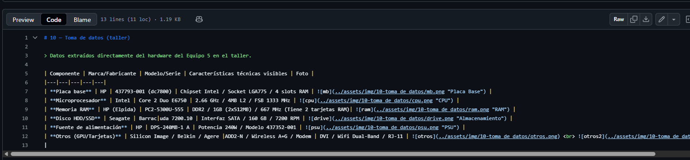
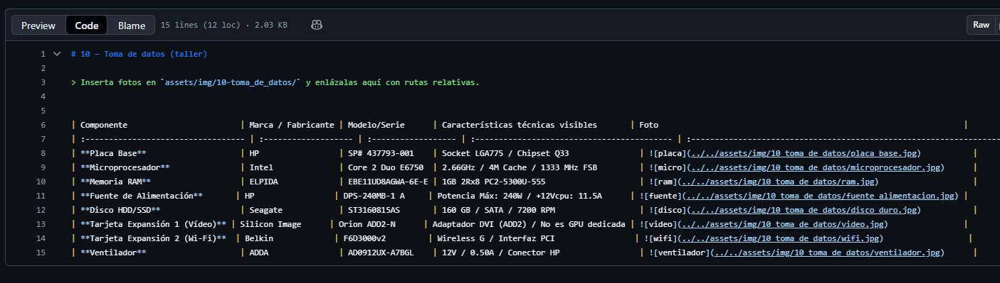
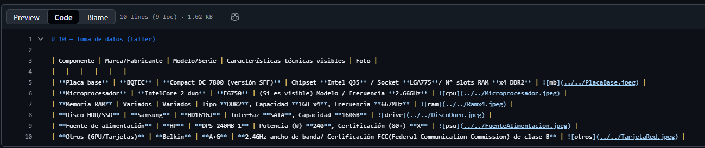
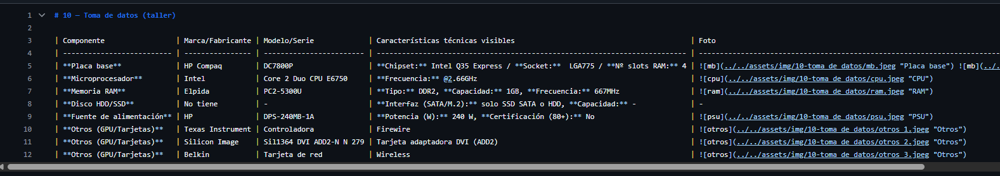

---
# 30 — Búsqueda y selección de mejoras de **hardware**

> **Objetivo:** Encontrar las **mejoras mínimas** que conviertan cada PC en **usable** para el centro de mayores, **respetando** S0/S1/S2.
## 1) Piezas candidatas (con enlaces y capturas)

Busca en **tiendas online españolas** (PcComponentes, Amazon ES, Coolmod, Wallapop/segunda mano con precaución) y documenta **al menos 2 opciones por categoría** (cuando aplique):

- **Almacenamiento:** SanDisk SSD 64 GB SATA III / Crucial M4 SSD 64 GB SATA III
- **Memoria RAM:** RAM DDR2 Corsair 4GB / RAM Samsung 4GB DDR3
- **Mantenimiento:** Pasta Térmica Noctua NT-H1 / Ewent Spray de Aire Comprimido 400Ml
- **Otros (si procede):** Adaptador Wifi USB Alfa Network / Altavoces PC

**Tabla almacenamiento:**

| Categoría      | Marca/Modelo            | Capacidad | Precio (€) | Tienda | URL                                                                                                                                                                                                                                                                                                                                                                                                                                                                                                                                                                                                                                                                                            | Captura                                                    |
| :------------- | :---------------------- | --------: | :--------- | :----- | :--------------------------------------------------------------------------------------------------------------------------------------------------------------------------------------------------------------------------------------------------------------------------------------------------------------------------------------------------------------------------------------------------------------------------------------------------------------------------------------------------------------------------------------------------------------------------------------------------------------------------------------------------------------------------------------------- | :--------------------------------------------------------- |
| Almacenamiento | SanDisk SSD SATA III    |     64 GB | 12,90      | Ebay   | [📎](https://www.ebay.es/itm/304411174497?chn=ps&google_free_listing_action=view_item)                                                                                                                                                                                                                                                                                                                                                                                                                                                                                                                                                                                                         | 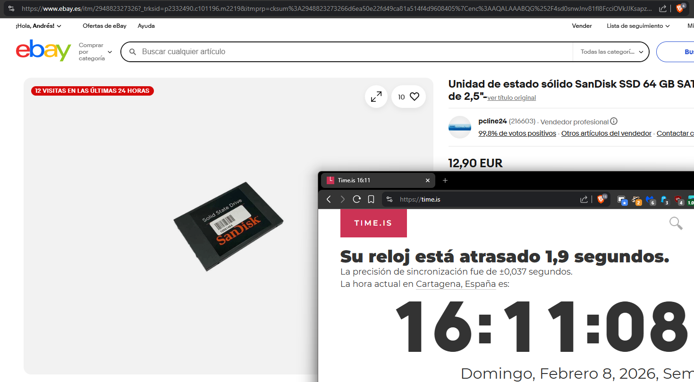 |
| Almacenamiento | Crucial M4 SSD SATA III |     64 GB | 12,90      | Ebay   | [📎](https://www.ebay.es/itm/294882327326?_trksid=p2332490.c101196.m2219&itmprp=cksum%3A2948823273266d6ea50e22fd49ca81a514f4d9608405%7Cenc%3AAQALAAABQG%252F4sd0snwJnv81fl8FcciOVkJJKsapzWEBwEzP3T1mKZ9WiaeV2kZNRn45y7sSRHRHm9bWdgirAyBMYxj3wGlazCHsgk9BKHYxXgbiMoQSXnD45RzGhdBj13I7S1l2VUNETe5pSZw1LT7YA1LEwgKmgmp8tAtZp2bKqRahbldvPHjh2MRotHxwDkvb0oMm3UvO7TUKYj2P8LyIJm9DR2EJZAEj7nO0ApF0KvHLToFZuxFMLm3j7wJwMZnB%252BHtFUnL7f%252BFCVbVeTgkoNU5QN3Au3k%252FO10OSjozfaCgASQTD3p6mfAQFSs6uVLj2vG3yIzEzPM3b2AmTZWy4SHLH9zCUDiiwGSAc0OFNm7a5fmdhIkAd8VuezZM8EcUmugMGr9y5sKOPrwN9FqXeaNCXw%252BeJOsQF5gD9BF%252Bk6KZCZKQpx%7Campid%3APL_CLK%7Cclp%3A2332490&itmmeta=01KGYVV7HF582YDW403CZX5GQW) | 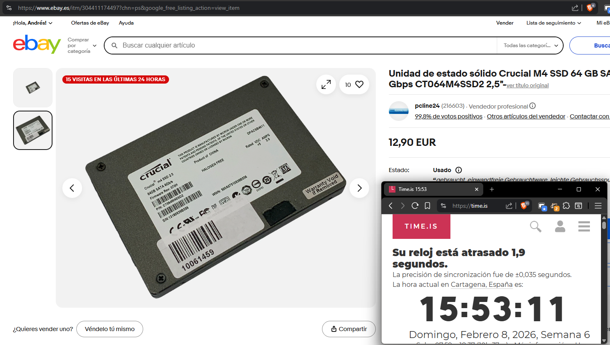  |

Tabla RAM:

| Categoría   | Marca/Modelo | Capacidad | Precio (€) | Tienda      | URL                                                                                       | Captura                              |
| :---------- | :----------- | --------: | :--------- | :---------- | :---------------------------------------------------------------------------------------- | :----------------------------------- |
| Memoria RAM | Corsair DDR2 |      4 GB | 5          | MilAnuncios | [📎](https://www.milanuncios.com/memorias-ram/memoria-ram-ddr2-corsair-4gb-531642609.htm) | 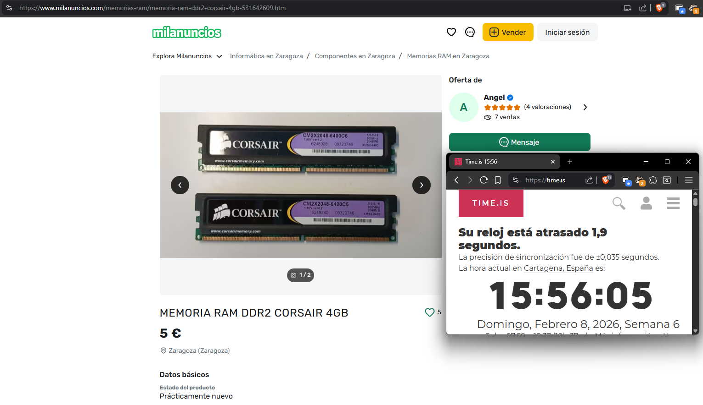  |
| Memoria RAM | Samsung DDR3 |      4 GB | 6          | Walapop     | [📎](https://es.wallapop.com/item/memoria-ram-samsung-4gb-ddr3-1228609279)                | 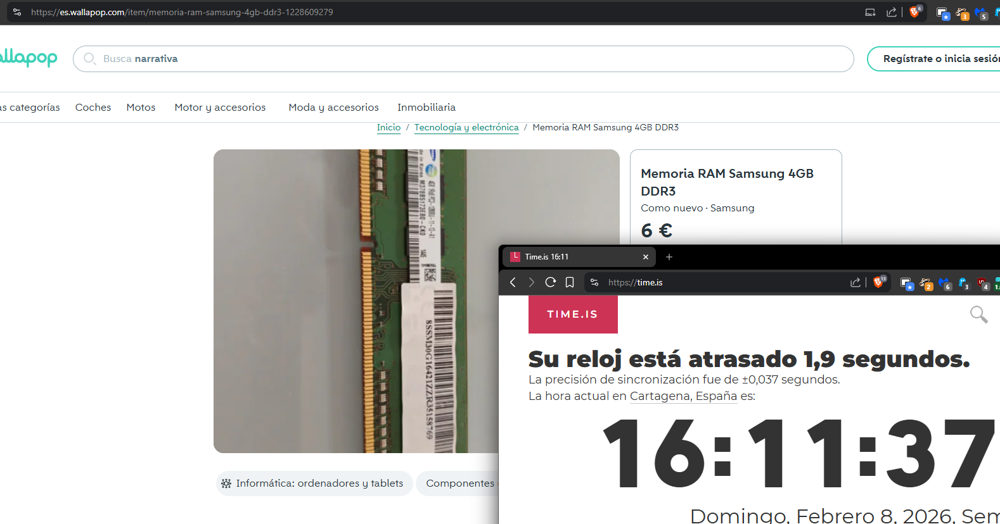 |

Tabla mantenimiento:

| Categoría     | Marca/Modelo                      | Precio (€) | Tienda        | URL                                                                           | Captura                                         |
| :------------ | :-------------------------------- | :--------- | :------------ | :---------------------------------------------------------------------------- | :---------------------------------------------- |
| Mantenimiento | Pasta Térmica Noctua NT-H1        | 2          | Walapop       | [📎](https://es.wallapop.com/item/pasta-termica-noctua-nt-h1-3-5g-1221315136) | 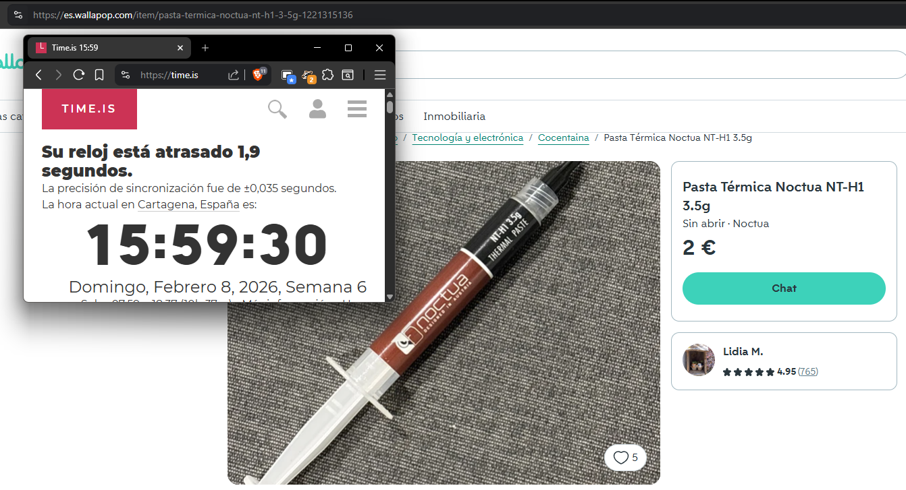 |
| Mantenimiento | Ewent Spray Aire Comprimido 400ml | 3,48       | PCcomponentes | [📎](https://www.pccomponentes.com/ewent-spray-de-aire-comprimido-400ml)      | 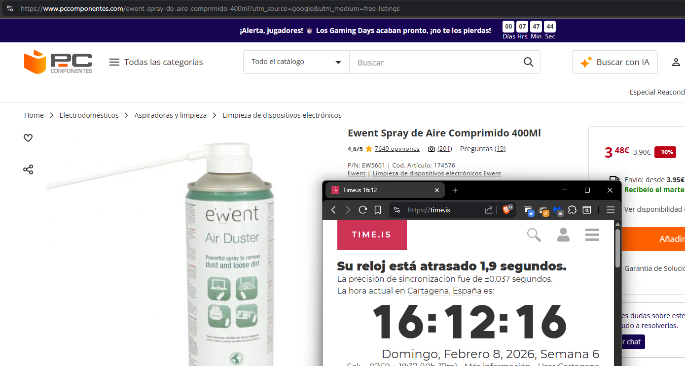  |

Tablas otros:

| Categoría | Marca/Modelo                    | Precio (€) | Tienda  | URL                                                                           | Captura                                     |
| :-------- | :------------------------------ | :--------- | :------ | :---------------------------------------------------------------------------- | :------------------------------------------ |
| Otros     | Adaptador Wifi USB Alfa Network | 3          | Walapop | [📎](https://es.wallapop.com/item/adaptador-wifi-usb-alfa-network-1228031796) | 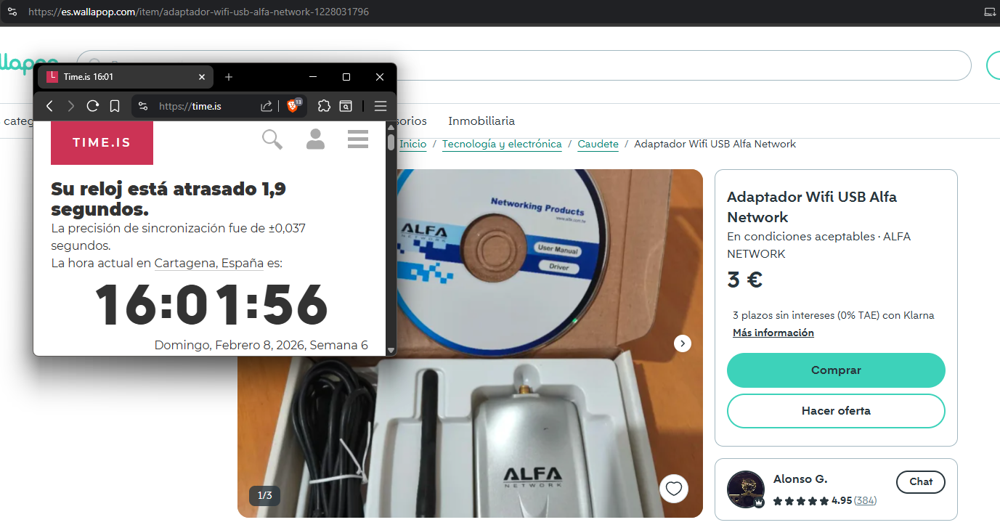      |
| Otros     | Altavoces PC                    | 2          | Walapop | [📎](https://es.wallapop.com/item/altavoces-pc-1228461804)                    | 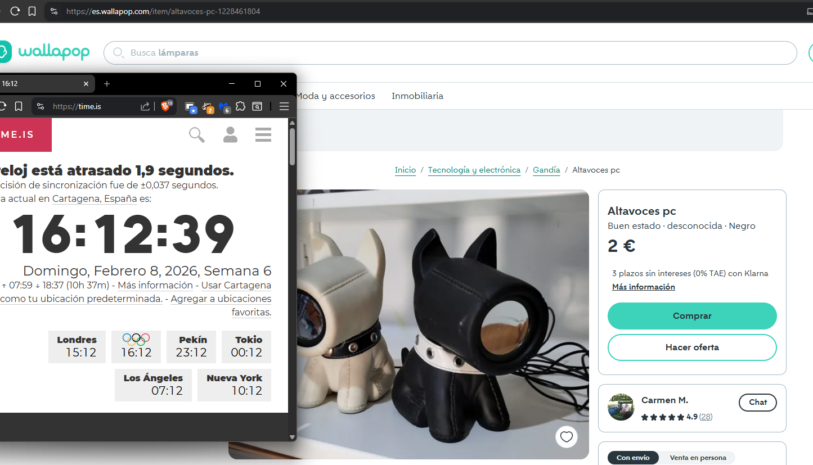 |

## 2) Compatibilidad técnica (justifica con datos)

Para **cada pieza** elegida, justifica la **compatibilidad** con tu lote:

- **RAM:** La placa base cuenta con 4 slots y en la mayoria de PCs de la flota solo se usa 1 ranura, entoces hay que encontrar otra opción de slot de RAM que sea compatible con la placa como ya puede ser de ddr2 o ddr3. El de ddr2 nos permite usar el dual channel de la RAM, y por eso es una buena opcion aunque sean solo 4GB en total.
- **SSD:** Aunque la mayoria de PCs tienen HDD, las caracterícese de la placa permiten usar SSD y por ello una opcion barata de SSD sata que no tenga mucha capacidad pero si un bajo precio es una opcion considerable para el bajo presupuesto.
- **Otros:** Para el mantenimiento hay que cambiar la pasta térmica, que no suele ser muy barata. Tambien es conveniente limpiar el polvo con aire comprimido, y una lata pequeña sirve para un PC entero. Aunque si se tuviera una pistola de aire seria mejor. Por ultimo, algunos PCs no tienen conexión por wifi o no tienen antena, entoces un adaptador simple hace su función, aunque no con la mayor velocidad. Al ser ordenadores de sobremesa, probablemente su monitor no tengan altavoces, por ello hay que mirar algunos en cas de no querer usar audífonos.

#### SSD
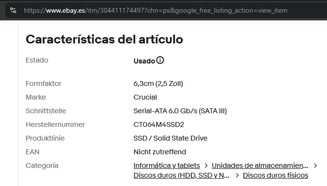

#### RAM
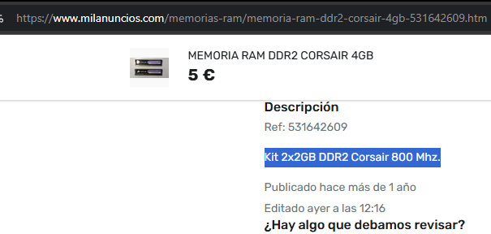

#### WiFi
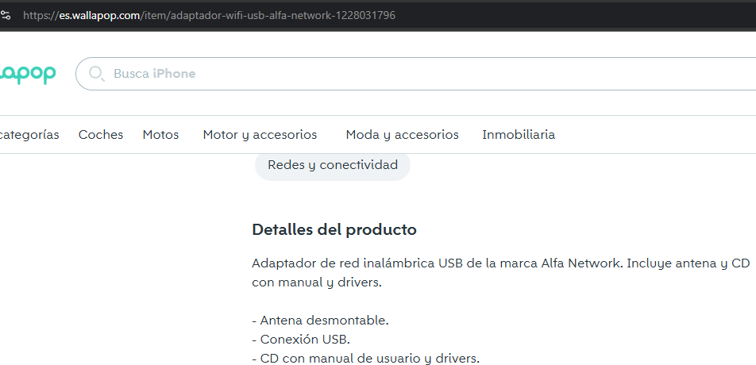

## 3) Mini‑estimación de impacto (sentido común + referencias)

En 3–5 líneas por categoría, explica el **impacto esperado**:

- **De HDD a SSD:** Es una actualización bastante importante, ya que permite que el SO arranque más rapido, pueda acceder mas rapido a los archivos y teniendo menos tirones en el explorador de archivos o al abrir ciertos programas. Haciendo que la fluidez del ordeandor aumente.
- **De 4 GB a 8 GB RAM:** Permite poder cargar las cosas más rapido con la ayuda del SSD que se le ha instalado. Da la posibilidad de hacer multitarea y tener varios programas abiertos a la vez, aunque no sea demasiado. Así tarda menos tiempo en cambiar entre ventanas o entre pestañas del navegador, ya que no tienen que cargar otra vez y se puede guardar en la RAM.
- **Pasta térmica/limpieza:** La pasta térmica permite que el ordenador pueda calentarse más ya que disipa más el calor generado, haciendo que le CPU no sufra de termal throttling y pueda tener un poco más de potencia. La limpieza por otro lado, permite que el ordenador este más limpio y los ventiladores no tengan suciedad que pueda atascarlos, generando menos ruido y más eficiencia en estos.

## 4) Escenario elegido y desglose de gasto (S0/S1/S2)

Completa la tabla con tu **propuesta final** y calcula el **gasto HW** total (sin mano de obra):

| **Escenario** | **Pieza**                  | **Precio Unit. (€)** | **Unidades** | **Total (€)** | **Nota**                        |
| ------------- | -------------------------- | -------------------- | ------------ | ------------- | ------------------------------- |
| S2            | SanDisk SSD SATA III 64 GB | 12,90                | 20           | 258,00        | Más rapido que el HDD.          |
| S2            | RAM Samsung DDR3 4GB       | 6,00                 | 20           | 120,00        | Permite multitarea.             |
| S2            | Pasta Térmica Noctua NT-H1 | 2,00                 | 5            | 20,00         | Necesario para que rinda mejor. |
| S2            | Adaptador Wifi USB Alfa    | 3,00                 | 20           | 60,00         | Conectividad inalambrica.       |
| **TOTAL**     |                            | **23,90 €**          | 80 piezas    | **478,00 €**  | **Cumple S2 (≤ 30€)**           |
Luego traslada el **Total HW** a `75-plan_presupuesto_hw_y_roi.md` para calcular costes y ROI.

---
# 65 — Análisis de mercado y PVP

## Comparables (3 mínimos)
| Plataforma             | Enlace                                                                                                                                                                                                                                                                                     | Captura                                          | Precio (€) | Especificación                                                    | Fecha/Hora        |
| ---------------------- | ------------------------------------------------------------------------------------------------------------------------------------------------------------------------------------------------------------------------------------------------------------------------------------------ | ------------------------------------------------ | ---------: | ----------------------------------------------------------------- | ----------------- |
| Ebay                   | [📎](https://ebay.us/m/2kWkTo)                                                                                                                                                                                                                                                             | 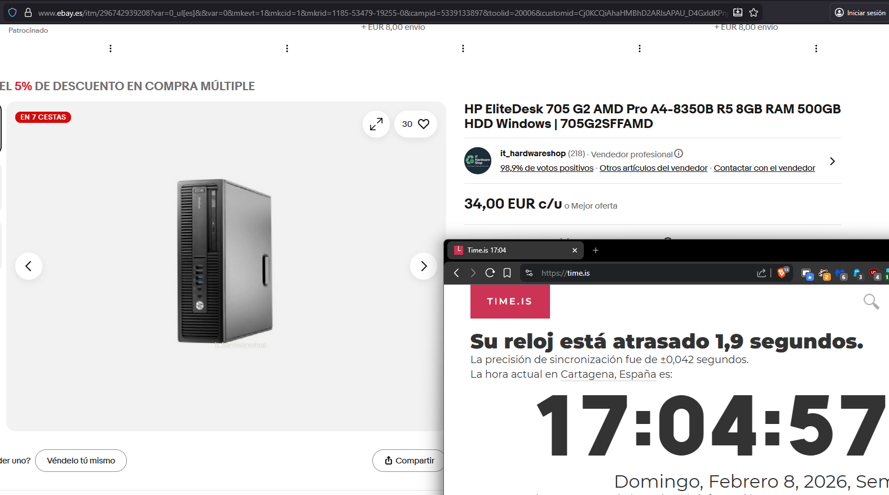 |      34,00 | AMD Pro A4-8350B R5 8GB RAM 500GB HDD Windows                     | 08/02/26 17:04:57 |
| Ebay                   | [📎](https://ebay.us/m/pV6JDe)                                                                                                                                                                                                                                                             | 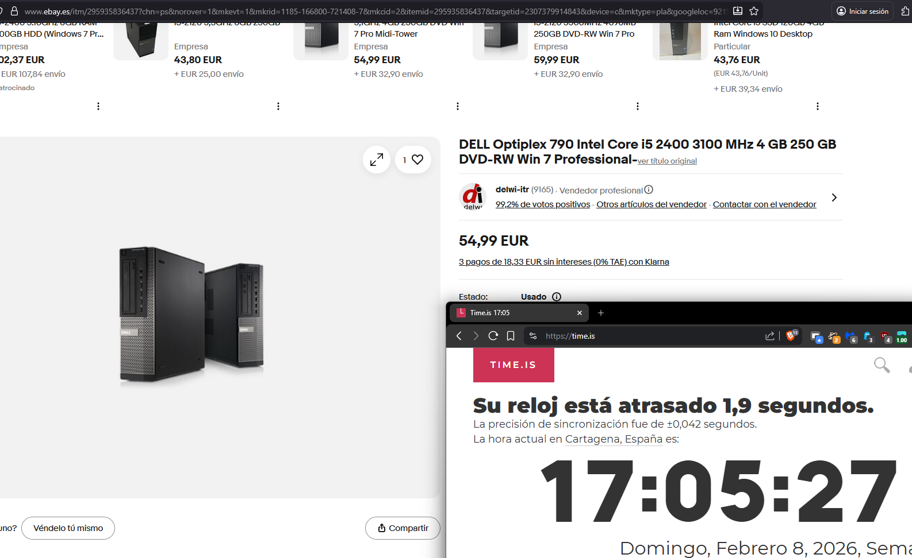 |      54,99 | Intel Core i5 2400 3100 MHz 4 GB 250 GB DVD-RW Win 7 Professional | 08/02/26 17:05:27 |
| Ordenadores-Portatiles | [📎](https://ordenadores-portatiles.com/pc-intel-core-i3/385211-lenovo-thinkcentre-m73-sff-reacondicionado-core-i3-3-4ghz-4-gb-ram-500-gb-hdd.html?utm_source=twenga&utm_campaign=twenga&utm_medium=cpc&click_id=c059c777dac975bd60ad278a14dda04c&gad_source=1&gad_campaignid=22487905426) | 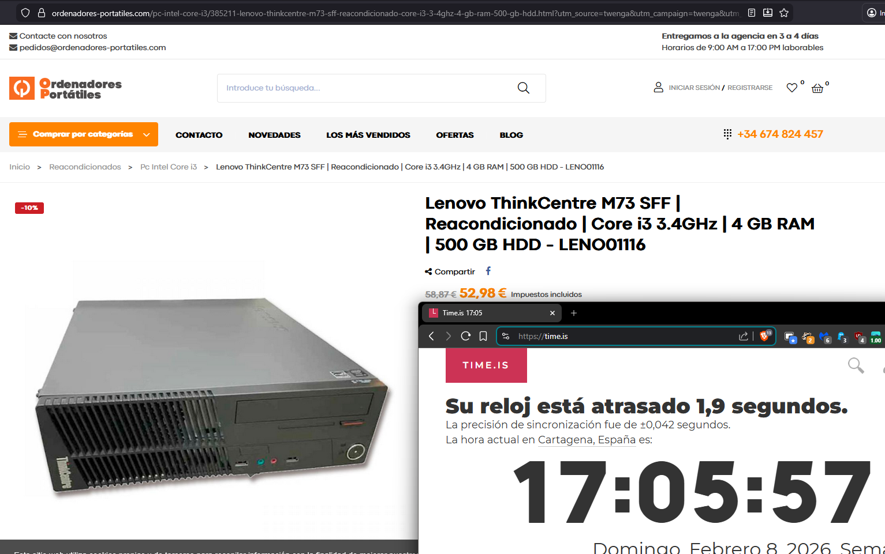 |      52,98 | Core i3 3.4GHz \| 4 GB RAM \| 500 GB HDD                          | 08/02/26 17:05:57 |

- Deben ser equipos **comparablemente viejos** pero **funcionales para Internet** (SSD y 8 GB si es posible).
- Fuentes: Wallapop, eBay, CashConverters, PcComponentes (remanufacturados), Amazon Warehouse…

## PVP objetivo
- Media precios comparables: (34,00 + 54,99 + 52,98) / 3 = 47,32 €
- Margen de competitividad: 10%
- **PVP objetivo:** 47,32 € - 10% = 42,59 €

---
# 75 — Plan de presupuesto (HW) y ROI

> Tras decidir **S0/S1/S2** en `30-busqueda_mejoras_hw.md`, completa costes y ROI.

- **Tarifa interna** (€/h): 15€
- **Horas por equipo**: 1h

| **Escenario** | **Gasto HW (€)** | **Horas** | **Tarifa (€/h)** | **Coste total (€)** | **PVP objetivo (€)** |  **ROI** | **¿Competitivo?**    |
| ------------- | ---------------: | --------: | ---------------: | ------------------: | -------------------: | -------: | -------------------- |
| S0            |             0,00 |       0,5 |            15,00 |               27,50 |                35,00 | 27 % | Sí pero malo         |
| S1            |            14,00 |      0,75 |            15,00 |               44,25 |                60,00 | 35 % | Sí pero muy limitado |
| S2            |            23,90 |       1,0 |            15,00 |               58,90 |                75,00 |     27 % | Sí calidad/precio    |
**Fórmulas (guía):**
- **Coste total** = 20 € + Gasto HW + (15 × 1)
- **ROI** = (75,00€ − 58,90€) / 58,90€ 

**Elección final y motivos:** 
Elijo el S2 ya que aumentando un poco el dinero por cada PC se pueden encontrar componentes decentes por segunda mano, haciendolo mejores por calidad precio respecto otros PCs de segunda mano. Por tanto estamos cobrando menos por algo mejor que ya se puede encontrar en el mercado, haciendo nuestro trabajo más valioso permitiendo subir el ROI. Además, a pesar de los impedimentos y limitaciones por el precio y material, se cumplen los objetivos para el centro de mayores, haciendo ordenadores decentes para las tareas que se requerían.
