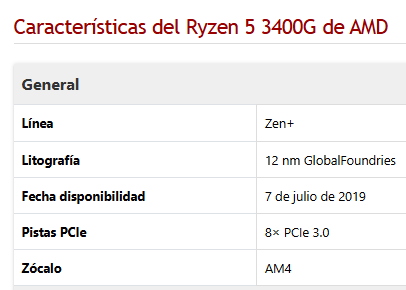
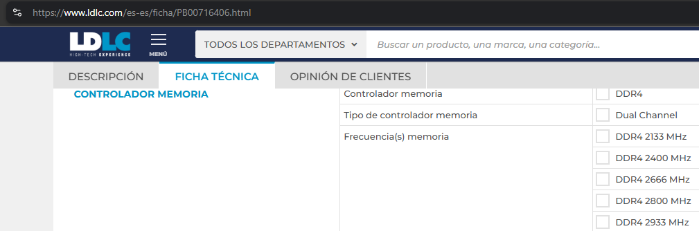
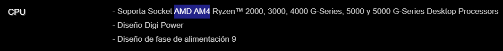
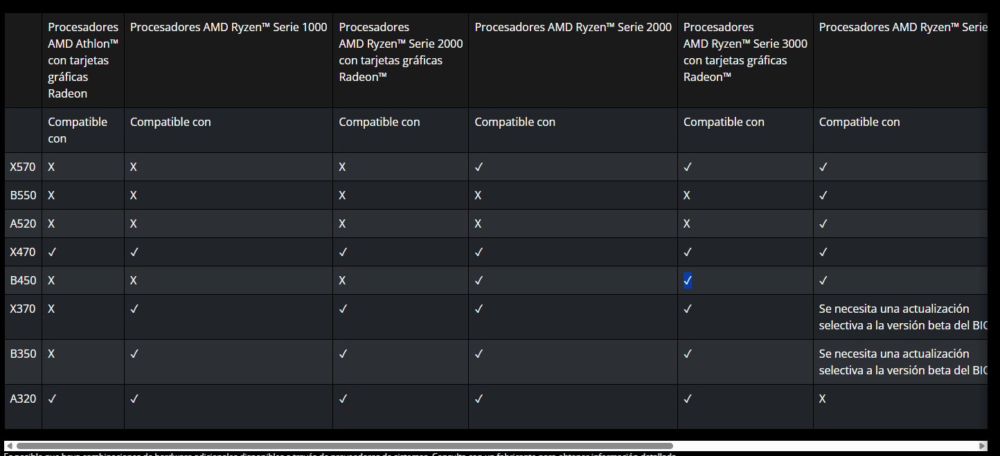
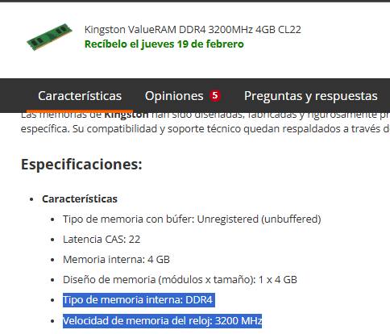
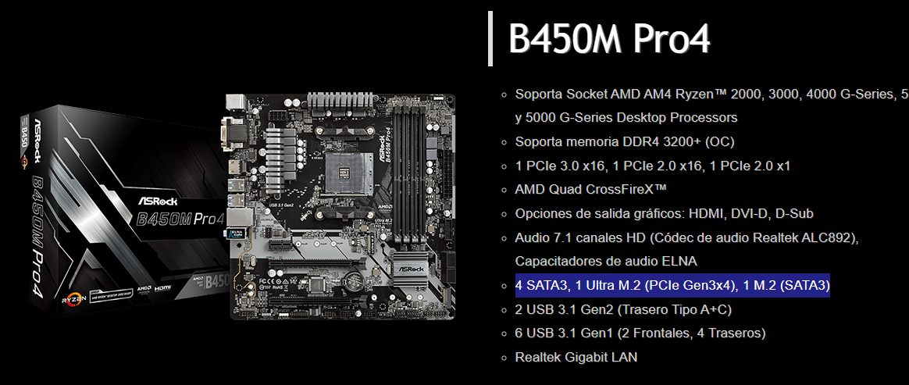
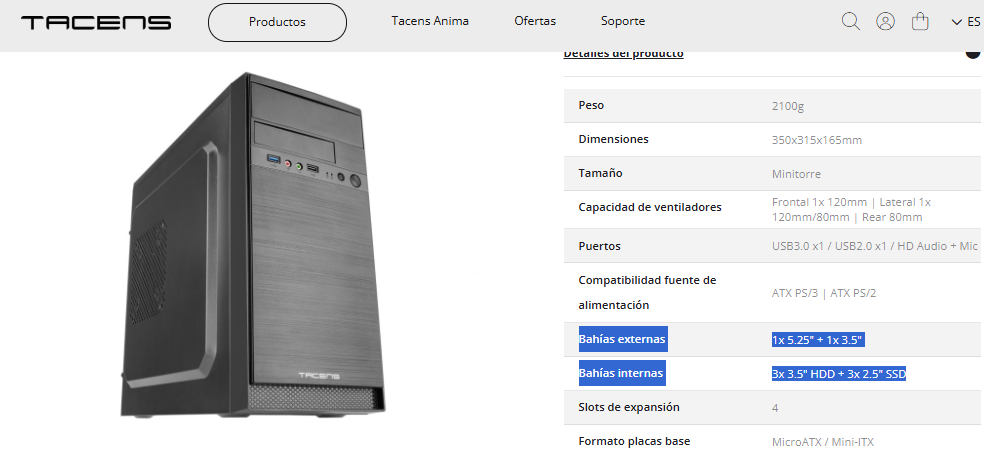
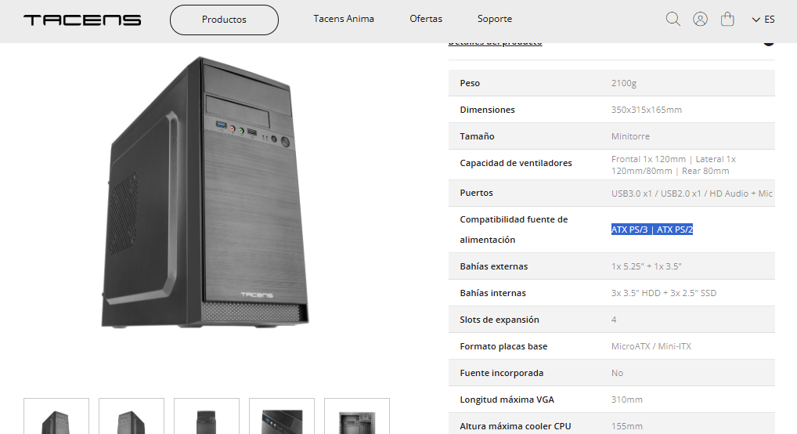
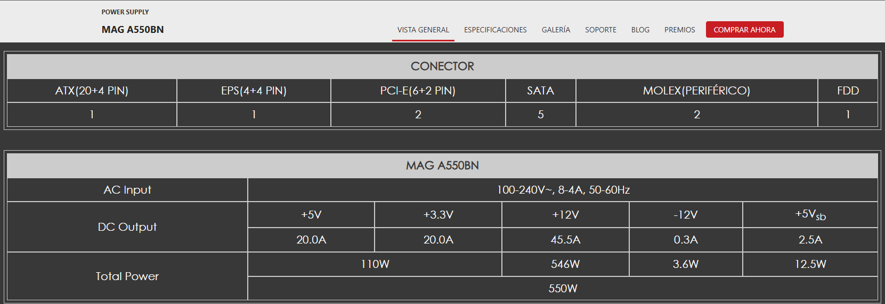
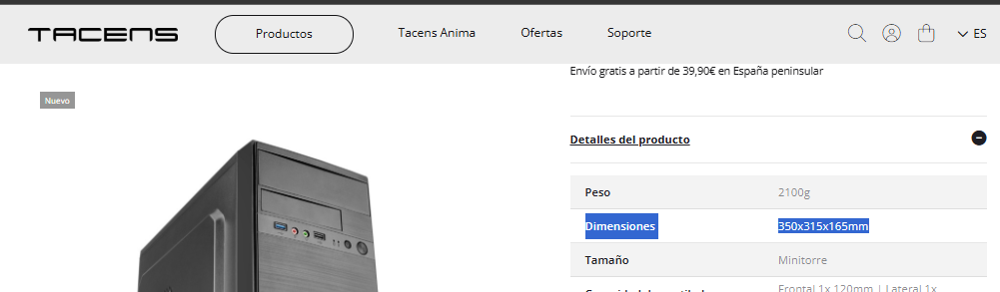

# Opción A — PC de oficina por piezas (PASO 1–7)

> Rellena cada paso usando la **plantilla**. Mantén el objetivo: **oficina**, precio ajustado y componentes razonables.
## PASO 1 — CPU con gráficos integrados
**Componente elegido:**  CPU
- **Marca y modelo:**  AMD Ryzen 5 3400G
- **Precio (€):**  69,50€
- **URL tienda:**  [📎LDLC](https://www.ldlc.com/es-es/ficha/PB00716406.html)

**Ficha técnica oficial (obligatorio):**  
- URL oficial (fabricante/estándar):  
- [Geektopia](https://www.geektopia.es/es/product/amd/ryzen-5-3400g/)
- [LDLC Ficha técnica](https://www.ldlc.com/es-es/ficha/PB00716406.html#specs-tech)
- [AMD](https://www.amd.com/es/products/specifications/processors.html?product-0=AMD+Ryzen%E2%84%A2+5+3400G+with+Radeon%E2%84%A2+RX+Vega+11+Graphics&product-1=)

**Características principales (resumen):**
- **Núcleos/Hilos:** 4 núcleos / 8 hilos
- **Frecuencia:** 3.7 GHz, frecuencia máxima 4.2 GHz
- **Gráficos Integrados:** Radeon™ RX Vega 11 Graphics (11 núcleos GPU a 1400 MHz)
- **Memoria Soporte:** DDR4, dual channel, velocidad máxima 2933 MHz
- **Caché:** 6 MB (L2: 2MB + L3: 4MB)
- **Socket:** AM4
- **TDP:** 65W
- **Versión PCI Express:** PCIe 3.0 x8.
- **Disipador:** Sí, incluido.

**Justificación (oficina):**
- Es un CPU con un rendimiento decente para tareas de ofimática normales y con graficos integrados, ahorrándose el precio de una tarjeta grafica dedicada. Ya que no es necesaria mucha más potencia grafica si no hay que hacer cálculos de graficos 3D o taras del estilo demandantes de GPU.
- Lo bueno de este modelo es que incluye un disipador básico que funciona muy bien y hace poco ruido, rondando temperaturas de 50ºC con un uso normal (desde la experiencia personal). Tambien hay que tener en cuenta que sin usar una grafica dedicada, el chasis tiene menos calor en el interior y el flujo de aire un poco más frio. 
- Consume 65W, por tanto no hay problema con tenerlo encendido toda una jornada laboral a largo plazo. 
- En conclusión, es un buen procesador con graficos integrados, que hace poco ruido y no se calienta demasiado y un consumo medio-bajo.

**Compatibilidad (obligatorio, con enlaces):**
- Compatibilidad clave 1:  Socket AM4
  - Evidencia (URL): [Geektopia](https://www.geektopia.es/es/product/amd/ryzen-5-3400g/)
   
   
- Compatibilidad clave 2:  Frecuencia RAM máxima
  - Evidencia (URL):  [LDLC Ficha técnica](https://www.ldlc.com/es-es/ficha/PB00716406.html#specs-tech)

## PASO 2 — Placa base compatible
**Componente elegido:**  Placa base AM4
- **Marca y modelo:**  ASRock B450M Pro4 R2.0
- **Precio (€):** 76,50€
- **URL tienda:**  [📎LDLC](https://www.ldlc.com/es-es/ficha/PB00462746.html)

**Ficha técnica oficial (obligatorio):**  
- URL oficial (fabricante/estándar):  
- [Asrock oficial](https://www.asrock.com/mb/AMD/B450M%20Pro4/index.la.asp#Specification)
- [AMD Chipsets](https://www.amd.com/es/products/processors/chipsets/am4.html#motherboard)

**Características principales (resumen):**
- **Socket y Chipset:** Socket AM4 / Chipset AMD B450
- **Formato:** Micro ATX
- **Memoria RAM:** 4 ranuras DDR4, Dual Channel, hasta 128 GB, hasta 3200
- **Almacenamiento:** 1 M.2 (PCIe Gen3 x4) + 1 M.2 (SATA3) + 4 SATA
- **Ranuras de Expansión:** 1 x PCI Express 3.0 x16 + 1 x PCI Express 2.0 x16 + 1 x PCI Express 2.0 x1
- **Salidas de Vídeo:** 1 x HDMI + 1 x puerto VGA + 1 x puerto DVI-D
- **Conectividad de Red:** Realtek Gigabit LAN
- **Puertos USB (Traseros):** 1 x USB 3.2 Gen 2 Tipo-C + 1 x USB 3.2 Gen 2 Tipo-A + 4 x USB 3.2 Gen 1 + 2 x USB 2.0
- **Audio:** Audio 7.1, Realtek

**Justificación (oficina):**
- Es una placa base AM4, compatible con el procesador AMD Ryzen 5 3400G con un precio bueno por las especificaciones que tiene.
- Personalmente he decidido no escatimar demasiado ya que la placa base es la base de todos los componentes, y una de gama baja pero decente es suficiente para asegurarse buena compatibilidad entre los otros componentes que he elegido.
- Es considerable que sea de una marca reconocida para tener un mejor soporte de la BIOS.
- El chipset que tiene, es compatible con esta serie de procesador, ademas de tener el mejor rendimiento para este.
**Compatibilidad (obligatorio, con enlaces):**
- Compatibilidad clave 1: Socket del CPU
  - Evidencia (URL): [Asrock oficial](https://www.asrock.com/mb/AMD/B450M%20Pro4/index.la.asp#Specification)

- Compatibilidad clave 2: Chipset compatible con la serie.
  - Evidencia (URL):  [AMD](https://www.amd.com/es/products/processors/chipsets/am4.html#motherboard)

## PASO 3 — Memoria RAM (mínimo 8 GB)
**Componente elegido:** Memoria RAM
- **Marca y modelo:** Kingston ValueRAM DDR4 3200MHz 4GB CL22
- **Precio (€):** 58,00€ (x 2 =116€)
- **URL tienda:** [📎PCCom](https://www.pccomponentes.com/kingston-valueram-ddr4-3200mhz-4gb-cl22)

**Ficha técnica oficial (obligatorio):**  
- URL oficial (fabricante/estándar):
- [PCCom especs](https://www.pccomponentes.com/kingston-valueram-ddr4-3200mhz-4gb-cl22)

**Características principales (resumen):**
- **Tipo y Capacidad:** DDR4 / 4 GB
- **Frecuencia:** 3200 MHz
- **Formato:** DIMM de 288 pines
- **Latencia:** CAS 22 (CL22)
- **Voltaje:** 1.2 V
- **Integridad de datos:** No ECC
- **Tipo de módulo:** Unbuffered

**Justificación (oficina):**
- Aunque sea un tamaño de RAM limitado, permite poder hacer multitasking con un navegador con no demasiadas ventanas abiertas y otro programa, aunque eso sea casi su máximo de programas abierto a la vez. De todos modos para tareas simples es suficiente esas velocidades e espacio.
- Hay que comprar dos módulos para aprovechar la velocidad del Dual Channel, por eso es mejor comprar 2 de 4 para tener 8Gb en vez de solo un modulo de 8Gb, aunque eso sea lo más barato.
- Lo malo es que no tiene disipador pasivo, pero para los tiempos que corren así son las circunstancias. Por ello hay que mantener un buen flujo de aire.
- La velocidad de la RAM es la mejor para la placa base, ya que es lo más rapido que puede ir. Ademas que el procesador utiliza gráficos integrados, la gráfica se alimenta directamente de esta RAM. Por ello, al usar módulos a 3200 MHz, le da un mejor rendimiento a estos graficos integrados.

**Compatibilidad (obligatorio, con enlaces):**
- Compatibilidad clave 1: Tipo DDR4
  - Evidencia (URL): [PCCom especs](https://www.pccomponentes.com/kingston-valueram-ddr4-3200mhz-4gb-cl22)

- Compatibilidad clave 2: Velocidad máxima
  - Evidencia (URL): [PCCom especs](https://www.pccomponentes.com/kingston-valueram-ddr4-3200mhz-4gb-cl22)

## PASO 4 — Almacenamiento (SSD)
**Componente elegido:** SSD SATA 2.5
- **Marca y modelo:** Silicon Power Ace A55 128GB
- **Precio (€):** 35,99€
- **URL tienda:** [📎PCCom](https://www.pccomponentes.com/silicon-power-ace-a55-25-128gb-ssd-ssd-sata-3)

**Ficha técnica oficial (obligatorio):** - URL oficial (fabricante/estándar):  
- [PCCom especs](https://www.pccomponentes.com/silicon-power-ace-a55-25-128gb-ssd-ssd-sata-3)

**Características principales (resumen):**
- **Capacidad:** 128 GB
- **Interfaz:** SATA III
- **Factor de forma:** 2.5 pulgadas
- **Velocidad de Lectura máx:** 550 MB/s
- **Velocidad de Escritura máx:** 420 MB/s
- **Tecnología:** 3D NAND Flash, SLC Cache technology
- **Resistencia:** Resistente a golpes y vibraciones por ser SSD y no tener un disco mecánico

**Justificación (oficina):**
- Este SSD tiene un precio bajo al ser un SSD SATA, siendo un paso medio en tema precio entre un NVMe y un HDD.
- En términos de velocidad, aunque no sea un NVMe, sigue siendo bastante más rapido que un HDD, de hecho, la diferencia en un uso simple del ordenador apenas va a ser notoria. El SO se va a seguir iniciando bastante rapido.
- Aunque no sea mucho espacio, he escogido este por su precio ajustado, porque al ser un ordenador de oficina solo seria necesario guardar documentos pequeños y programas simples, ya que el resto de almacenamiento a necesitar va a estar en la nube, ya sea en un servidor propio o externo.

**Compatibilidad (obligatorio, con enlaces):**
- Compatibilidad clave 1: Puerto SATA en placa base
  - Evidencia (URL): [ASRock](https://www.asrock.com/mb/AMD/B450M%20Pro4/index.la.asp#Specification)

- Compatibilidad clave 2: Bahía de 2.5" en chasis
  - Evidencia (URL): [Tacens](https://www.tacens.es/cajas/ac4/)

## PASO 5 — Fuente (PSU)
**Componente elegido:** Fuente de Alimentación
- **Marca y modelo:** MSI MAG A550BN 550W 80 Plus Bronze
- **Precio (€):** 49,90€
- **URL tienda:** [📎PCCom](https://www.pccomponentes.com/msi-mag-a550bn-550w-80-plus-bronze)

**Ficha técnica oficial (obligatorio):**
- URL oficial (fabricante/estándar):
- [MSI](https://es.msi.com/Power-Supply/MAG-A550BN)

**Características principales (resumen):**
- **Potencia:** 550 W
- **Certificación:** 80 PLUS Bronze
- **Ventilador:** 120mm
- **Protecciones:** OCP, OVP, OPP, OTP, SCP
- **Diseño de circuito:** DC a DC
- **Cableado:** No modular, cables negros.

**Justificación (oficina):**
- En la fuente es importante nunca escatimar, por su potencia no es necesario que sea una certificación Gold o más, pero si es importante que tenga una certificación minima y sea de una marca reconocida, comprobando que las reseñas y opinión de la fuente sea decente. Por ello, aunque sea un pc de oficina, queremos asegurar de que su consumo no tenga problemas en el uso diario del equipo.
- Aunque 550W sea demasiado para un procesador simple, por el precio y certificación es mejor que otras de 350W por ejemplo. Así por igual, hará menos ruido y trabajara de manera menos "forzada" ya que tiene potencia de sobra. También es para considerar que los equipos se pueden mejorar, ya sea añadiéndole una tarjeta grafica o cambiando el procesador y no haria falta cambiar la fuente.
- Por sus especificaciones, tiene bastantes protecciones y la certificación que dan más fiabilidad a la fuente y su uso constante.

**Compatibilidad (obligatorio, con enlaces):**
- Compatibilidad clave 1: Formato ATX que encaja en el chasis
 - Evidencia (URL): [Tacens](https://www.tacens.es/cajas/ac4/)

 
- Compatibilidad clave 2: Conectores placa y cpu
 - Evidencia (URL): [Tacens](https://www.tacens.es/cajas/ac4/)

## PASO 6 — Chasis
**Componente elegido:** Chasis
- **Marca y modelo:** Tacens Anima AC4 USB 3.0
- **Precio (€):** 22,91€
- **URL tienda:** [📎PCCom](https://www.pccomponentes.com/tacens-anima-ac4-usb-30-negro)

**Ficha técnica oficial (obligatorio):** - URL oficial (fabricante/estándar):  
- [Tacens](https://www.tacens.es/cajas/ac4/)

**Características principales (resumen):**
- **Formato:** Micro ATX / Mini ITX
- **Material:** Aleación de alta calidad, acero SGCC y frontal ABS
- **Refrigeración:** Soporta ventilador lateral de 120mm y trasero de 80mm
- **Conexiones frontales:** 1 x USB 3.0, 1 x USB 2.0, Audio HD + Mic
- **Dimensiones:** 350x305x165 mm
- **Peso:** 2.2Kg

**Justificación (oficina):**
- Es una caja bastante barata que incluye conectores frontales y un diseño que se ve resistente.
- Tiene un tamaño compacto y sencillo que no desentona en ninguna oficina y no ocupa mucho. No tiene ni luces ni un cristal, pero es funcional. Cumple su función
- Desgraciadamente no incluye un ventilador, pero para este caso con el disipador y la entrada de aire que tiene es suficiente. Asi que sin ningún problema se le puede añadir un ventilador que traiga aire frio de afuera y otro que lo expulse, lo cuál hara un poco más de ruido pero mantendrá un mejor flujo de aire.

**Compatibilidad (obligatorio, con enlaces):**
- Compatibilidad clave 1: Soporte Placa Base Micro-ATX. (Teniendo en cuenta que la placa es micro ATX)
  - Evidencia (URL): [Tacens especs](https://www.tacens.es/cajas/ac4/)

- Compatibilidad clave 2: Tamaño libre para el disipador y otros componentes
  - Evidencia (URL): [Tacens especs](https://www.tacens.es/cajas/ac4/)

## PASO 7 — Presupuesto final

Se ha priorizado bastante el precio y la fiabilidad que pueden dar esos componentes a largo plazo. Ajustando el presupuesto en la CPU, chasis, SSD y en la RAM, pero invirtiendo en fuente y en placa que permiten actualizar a mejores componentes. Ya que ajustarse demasiado a un presupuesto bajo puede ser contraproducente, y más en un entorno laboral.

Seleccionando un socket AM4 por la relacion calidad-precio de estos procesadores AMD con graficos y potencia decentes. El resto de componentes buscan asegurar que funcione todo y ya, sin tener que complicarse mucho más a posteriori y permitiendo actualizar sin problema, ya sea poniendo más ventiladores, una GPU o alguna tarjeta extra como de Wifi.

>El precio de la RAM es teniendo en cuenta que compramos 2 módulos para el Dual Channel.

| Componente | Modelo                      | Precio (€)   | URL tienda                                                                           |
| :--------- | :-------------------------- | :----------- | :----------------------------------------------------------------------------------- |
| CPU        | AMD Ryzen 5 3400G           | 69,50 €      | [LDLC](https://www.ldlc.com/es-es/ficha/PB00716406.html)                             |
| Placa base | ASRock B450M Pro4 R2.0      | 76,50 €      | [LDLC](https://www.ldlc.com/es-es/ficha/PB00462746.html)                             |
| RAM        | Kingston DDR4 3200 2x4GB    | 116 €        | [PCCom](https://www.pccomponentes.com/kingston-valueram-ddr4-3200mhz-4gb-cl22)       |
| SSD        | Silicon Power Ace A55 128GB | 35,99 €      | [PCCom](https://www.pccomponentes.com/silicon-power-ace-a55-25-128gb-ssd-ssd-sata-3) |
| PSU        | MSI MAG A550BN 550W         | 49,90 €      | [PCCom](https://www.pccomponentes.com/msi-mag-a550bn-550w-80-plus-bronze)            |
| Chasis     | Tacens Anima AC4            | 22,91 €      | [PCCom](https://www.pccomponentes.com/tacens-anima-ac4-usb-30-negro)                 |
| **TOTAL**  | **PC Oficina**              | **370,80 €** |                                                                                      |
