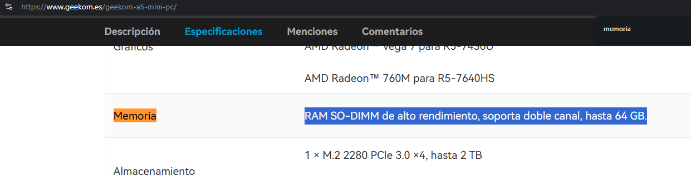
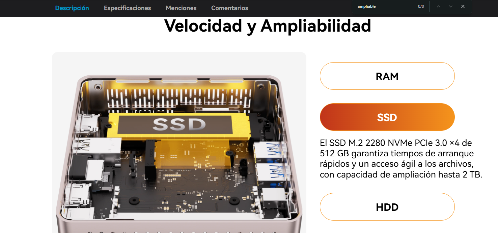

# Opción B — Mini PC ya montado (PASO 8)

## PASO 8 — Mini PC alternativo

Producto elegido: Mini PC
- **Marca y modelo exacto:** Geekom A5
- **Precio (€):** 465,00 € ~ 489,00 € (Según ofertas)
- **URL tienda:** [📎Geekom ES](https://www.geekom.es/geekom-a5-mini-pc/)

**Ficha técnica oficial (obligatorio):**
- URL oficial del fabricante: [Geekom A5 especs](https://www.geekom.es/geekom-a5-mini-pc/)

**Especificaciones:**
- **CPU:** AMD Ryzen™ 7 5825U (8 núcleos / 16 hilos, 4.5 GHz)
- **RAM:** 16 GB DDR4 3200MHz
- **SSD/almacenamiento:** 512 GB M.2 NVMe SSD
- **Conectividad:** Wi-Fi 6, Bluetooth 5.2, LAN 2.5G Gigabit Ethernet.
- **Puertos:** 3x USB 3.2 Gen 2, 1x USB 2.0, 2x USB-C (con DisplayPort), 2x HDMI 2.0b, Lector tarjetas SD, Jack audio.
- **Tamaño / consumo:** 117 x 112 x 49.2 mm / TDP 15W (muy bajo consumo)

**Ventajas (mínimo 4):**
- La potencia de este procesador es muchisimo mejor que del PC por piezas, permitiendo ya poder ejecutar programas más complejos, renderizar graficos 3D, edición de fotografía y vídeo y un uso mas profesional y menos de simple ofimática.
- La RAM preinstalada es de muchisima mayor capacidad y a la máxima velocidad de DDR4, ya que es menos cara que comprar los slots de manera individual.
- Está lista para usar con Windows 11 Pro instalado, aunque se le puede hacer Dual Boot sin problema.
- Menor espacio y menor consumo, puede estar encima de una mesa sin estorbar. Además esto hace que si no esta en un uso exigente, no haga demasiado ruido.
- Más almacenamiento a mayor velocidad.

**Contras (mínimo 4):**
- Si se hace un uso exigente de la CPU se puede calentar y el ventilador hará bastante más ruido al ser más pequeño. No tiene un chasis que este vacio por dentro para enfriar el aire que llega al disipador asi que es a considerar que la temperatura de la sala no sea muy alta.
- La grafica integrada aunque es decente, puede que se quede corta respecto a otras.
- La fuente va por fuera como el cargador de un portátil, dependiendo del set up de la oficina puede estorbar el adaptador de corriente.
- El precio son 120€ más que por piezas, pero es una inversión muy considerable. Por tanto, si hay un presupuesto establecido para los equipos de los trabajadores, se podrán comprar menos PCs que si se comprasen por piezas.

**¿Para qué oficina SÍ / para qué NO?**
- **Sí:** Para usuarios que tienen muchas tareas abiertas, desarrolladores web, edición de fotografía o puestos que necesiten software profesional pero no muy demandante.
- **No:** Para oficinas que necesiten mucha potencia gráfica, ya sea renderizado de video o desarrollo 3D, ya que no tiene una GPU dedicada. O por el contrario, para puestos de oficina que no necesiten mucha potencia o usar software muy demandante.

**Compatibilidad/ampliación (con enlaces):**
- **¿Se puede ampliar RAM?** Sí, admite hasta 64 GB de módulos SODIMM DDR4
  - Evidencia: [Geekom especs](https://www.geekom.es/geekom-a5-mini-pc/)

- **¿Se puede ampliar SSD?** Sí, se puede cambiar el NVMe hasta 2TB. Tambien se puede añadir un SSD SATA hasta 1TB o un HDD hasta 2TB.
  - Evidencia: [Geekom especs](https://www.geekom.es/geekom-a5-mini-pc/)

## Comparación rápida A vs B

| Aspecto                            | Opción A (Por piezas - Ryzen 3400G)                                                                                             | Opción B (Geekom A5)                                                         |
| ---------------------------------- | ------------------------------------------------------------------------------------------------------------------------------- | ---------------------------------------------------------------------------- |
| **Precio total**                   | 344,25 €                                                                                                                        | 465,00 €                                                                     |
| **Rendimiento esperado (oficina)** | Bueno (4 núcleos / 8 hilos)                                                                                                     | Muy bueno (8 núcleos / 16 hilos)                                             |
| **Ampliación (RAM/SSD)**           | Permite ampliar hasta 64 GB de RAM en 2 módulos y hasta muchísimos TB de almacenamiento, dependiendo de los puertos de la placa | Permite ampliar la ram hasta 64 y hasta 5TB máx., repartido entre SSDs y HDD |
| **Consumo/ruido/espacio**          | Consumo medio / Silencioso / Ocupa espacio                                                                                      | Poco consumo / Ruidoso bajo carga / Ocupa poco                               |
| **Facilidad de despliegue**        | Requiere montaje                                                                                                                | Listo para usar                                                              |
| **Garantía/soporte**               | Garantía por componentes individuales                                                                                           | Garantía de 3 años                                                           |
